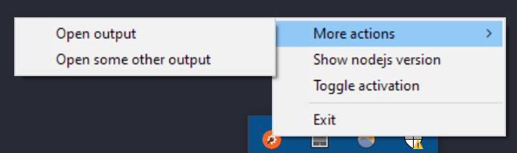

# System tray task launcher

A script/app launcher that displays the available action in the system tray.

The actions are defined as nodejs scripts.



## Installation

```
git clone git@github.com:ionutvmi/system-tray-launcher.git
pnpm install

# to start the application
pnpm start main.js
```

## Creating custom actions

The menu items are defined in the `actions` folder as `.js` or `.mjs` files.
Each file should export an `initialize()` function which will return an object
with the details for each menu item.

To initialize the action folder run the following commands:

```sh
mkdir actions
cd actions
git init
touch myCustomAction.js
```

To define a menu item the js script should have the following structure:

```js
// myCustomAction.js
export function initialize() {
    let item = {
        title: 'Toggle activation',
        click: (context) => {
            // do some work here

            // optionally update the menu item
            item.checked = !item.checked;
            item.title = `Toggle activation: Last updated on ${new Date().toUTCString()}`;

            context.systray.sendAction({
                type: 'update-item',
                item: item,
            });
        },
    };
    return item;
}
```

Note: You will need to `restart` the application for the new action to become visible.

To find more details about the structure of an item object review the documentation
available at:
https://github.com/felixhao28/node-systray

## Release notes

Jan 23rd 2022

-   Initial release

## Author

Mihai Ionut Vilcu

-   [github/ionutvmi](https://github.com/ionutvmi)
-   [twitter/mihaivlc93](http://twitter.com/mihaivlc93)
